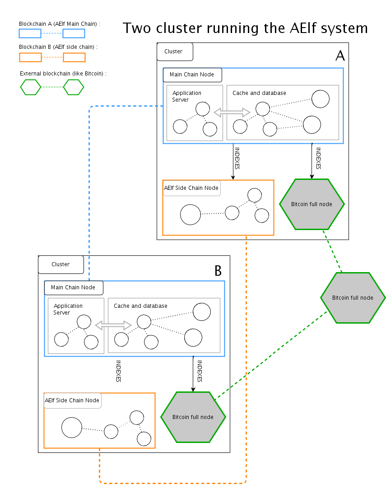

# Technical documentation for the Ælf project

As the whitepaper already states the AElf kernel will be built in a similar way to the Linux kernel. It will implement the basic building blocks that will allow other developers to build “functionality” on top of it. The whitepaper also states that users can redefine the “core” through interface.

## Table of Contents

* [Data Structures](#1data-structures)
* [Components](#2components)
* [AElf Topology](#3aelf-topology)

## Data Structures

## Components

## AElf topology 

